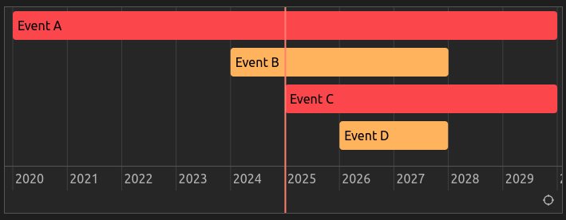
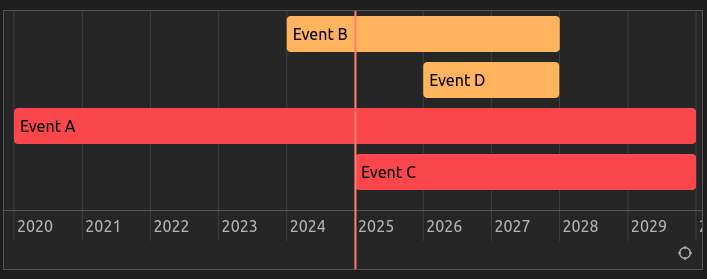
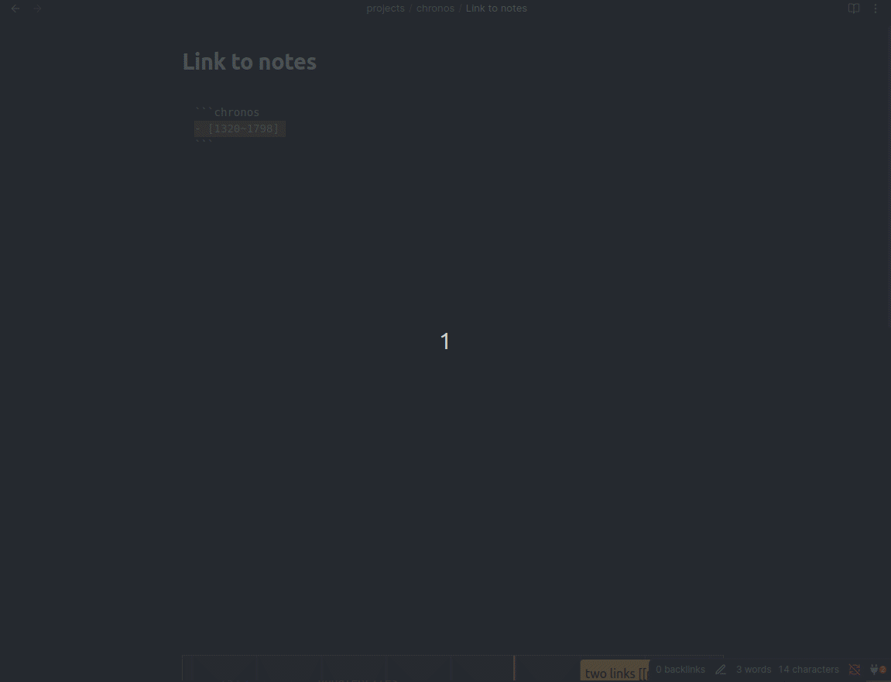
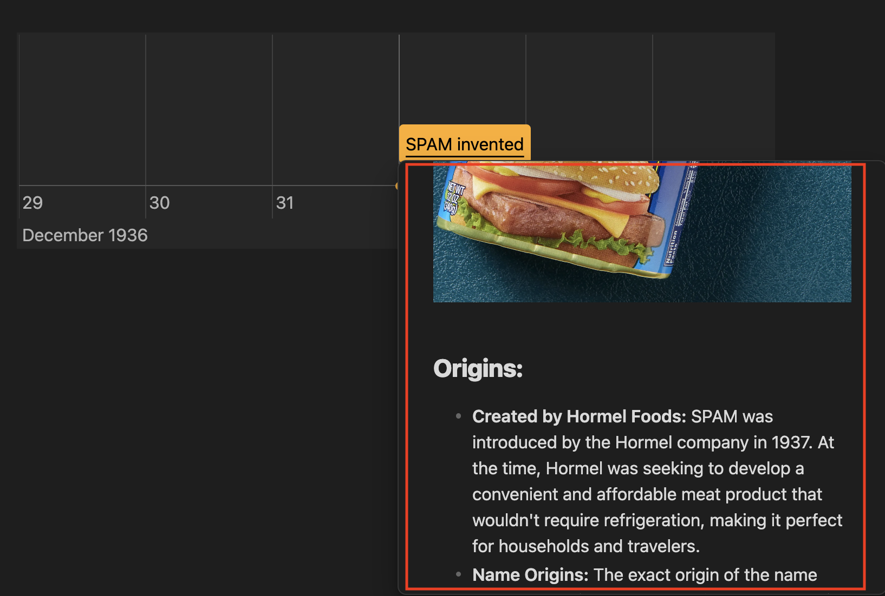

# Chronos Timeline: interactive timelines for Obsidian

Render interactive timelines in your Obsidian notes from simple Markdown. Make time make sense.

Powered by the [vis-timeline](https://www.npmjs.com/package/vis-timeline) library.

Try it in the [Live Playground](https://clairefro.github.io/chronos-timeline-md) 


<a href="https://www.buymeacoffee.com/clairefro"></a>

## Features

- Portable plain text data
- Text-to-timeline with AI
- Note linking
- Grouping
- Colors
- [Render timelines anywhere](https://clairefro.github.io/chronos-timeline-md) outside Obsidian

## Quickstart

Create timelines in your notes by opening a `chronos` codeblock and adding items

````markdown
```chronos
- [1789~1799] French Revolution
- [1791~1804] Haitian Revolution
- [1776] American Declaration of Independence
```
````


You can insert blank, basic, or advanced templates using the Command Pallete (`ctrl/cmd` + `p`, "Chronos")

### Insert basic template


### Insert advanced template


### Generate timeline with AI

Highlight text in your notes and run the "Generate" command.

Input can be long text in your notes with time information, or vague like:

- "Detailed history of the Cold War"
- "Compare the life and works of Borges and C.S. Lewis"
- "Year and location of the past 20 Olympic games. Do not group. Do use points not events"


### Cheatsheet

After installing the Chronos Timeline plugin, paste the contents of [this cheatsheet](./docs/chronos-cheatsheet.md) into a file in your vault to play with examples

## Contents

- [Chronos Timeline: interactive timelines for Obsidian](#chronos-timeline-interactive-timelines-for-obsidian)
    - [Features](#features)
    - [Quickstart](#quickstart)
        - [Insert blank](#insert-blank)
        - [Insert basic template](#insert-basic-template)
        - [Insert advanced template](#insert-advanced-template)
        - [Generate timeline with AI](#generate-timeline-with-ai)
        - [Cheatsheet](#cheatsheet)
    - [Contents](#contents)
- [Syntax Overview](#syntax-overview)
    - [A note on dates](#a-note-on-dates)
        - [Date ranges](#date-ranges)
        - [BCE time](#bce-time)
        - [Limitations](#limitations)
    - [Events `-`](#events--)
        - [Events with a single date](#events-with-a-single-date)
        - [Events with start and end dates](#events-with-start-and-end-dates)
        - [Events with descriptions](#events-with-descriptions)
    - [Periods `@`](#periods-)
    - [Points `*`](#points-)
    - [Markers `=`](#markers-)
    - [Comments `#`](#comments-)
    - [Flags `>`](#flags-)
        - [ORDERBY flag](#orderby-flag)
        - [DEFAULTVIEW flag](#defaultview-flag)
            - [Example](#example)
    - [Modifiers](#modifiers)
        - [Colors `#color`](#colors-color)
        - [Groups `{}`](#groups-)
    - [Advanced example](#advanced-example)
- [Note linking (beta)](#note-linking-beta)
- [Dynamic Timelines](#dynamic-timelines)
    - [Prerequisites](#prerequisites)
    - [Basic Example](#basic-example)
    - [Advanced Usage](#advanced-usage)
    - [Combining Dynamic and Static Events](#combining-dynamic-and-static-events)
    - [Tips](#tips)
- [Actions](#actions)
    - [Edit](#edit)
    - [Refit](#refit)
- [Localization](#localization)

# Syntax Overview

Chronos parses Markdown in `chronos` code blocks into objects on a timeline

````markdown
```chronos
<chronos timeline items here>
```
````

The first character of each line in your `chronos` block determines the item type:

- [Events](#events--) (`-`)
- [Periods](#periods-) (`@`)
- [Points](#points-) (`*`)
- [Markers](#markers-) (`=`)
- [Comments](#comments-) (`#`)
- [Flags](#flags-) (`>`)

Certain items can be modified with colors and group membership (see [Modifiers](#modifiers))

## A note on dates

Chronos can visualize dates from the year down to the second level, using the syntax `YYYY-MM-DDThh:mm:ss`.

The only required component of a date is the year (`YYYY`). Beyond that, you can specify additional time granularity as needed for your use case.

If not explicitly provided:

- The month and day default to `01` (January and the 1st)
- The hour, minute, and second default to `00` (top of the hour or minute)

**Hours** use 24-hr military time. So 3am is `03`, while 3pm is `15`

**Examples**

```
- [2020] A year
- [2020-02] A month
- [2020-02-28] A day
- [2020-02-28T12] An hour
- [2020-02-28T12:30] A minute
- [2020-02-28T12:30:09] A second
```


### Date ranges

Date ranges are separated by a tilde `~`, **NOT a hyphen**! Look out :)

The start and end date must be in chronological order.

```
- [2020~2024]
- [2024-02-28~2024-05-11]
- [2024-02-28T05:30~2024-02-28T08:30]
```

### BCE time

You can signify BCE times with the negative symbol (-)

```
- [-10000]    <--- 10000 BCE
- [-550~-20]  <--- 550 ~ 20 BCE
- [-550~550]  <--- 550 BCE ~ 550 CE
```

### Limitations

- Dates **must be between year 271,821 BCE and 275,761 CE**, due to how Dates work in JS

## Events `-`

Events can include a single date or a date range.

### Events with a single date

**Syntax**

```
- [Date] Event Name
```

Only `[Date]` is required. If no `Event Name` is provided, the event title will default to the date or date range.

**Example**

````markdown
```chronos
- [1879-03-14] Einstein born
```
````


### Events with start and end dates

A date range is represented with a tilde (`~`) between the start and end dates.

**Syntax**

```
- [Date~Date] Event Name
```

**Example**

````markdown
```chronos
- [1991~2001] Time I believed in Santa
```
````


### Events with descriptions

You can add additional information to an event by adding a pipe `|` after the Event name. This text will appear in a popup when you hover over an event.

**Example**

````markdown
```chronos
- [1991~2001] Time I believed in Santa | ended when my brother tried to videotape Santa with a hidden camera
```
````


## Periods `@`

Periods are spans of time displayed with a semi-transparent background. **Periods must be a range with a start and end date**. `Period Name` is optional

```
@ [Date~Date] Period Name
```

**Example**

````markdown
```chronos
@ [-300~250] #red Yayoi Period
- [-100] Introduction of rice cultivation
- [-57] Japan’s first recorded contact with China

@ [250~538] Kofun Period
- [250] Construction of keyhole-shaped kofun burial mounds begins
- [369] Yamato state sends envoys to Korea
```
````


## Points `*`

Points are ideal for marking a point in time. You can optionally add a `Description` that will appear on hover.

```
* [Date] Point Name | Description
```

````markdown
```chronos
- [2024-02-26~2024-03-10] Tournament
* [2024-02-26] Game 1 | Austin
* [2024-02-28] Game 2 | Los Angeles
* [2024-03-06] Game 3 | Tokyo
* [2024-03-10] Game 4 | Jakarta
```
````


## Markers `=`

Markers can be used to highlight a key milestone in time. **Markers must be a single date**. `Marker Name` is optional

```
= [Date] Marker Name
```

**Example**

````markdown
```chronos
= [1440] Invention of the Gutenberg Press

- [1455] Gutenberg Bible Printed
@ [1501~1600] The Spread of Printing
- [1517] Martin Luther's 95 Theses
```
````


## Comments `#`

Chronos will ignore any line that starts with `#`. You can use this to write comments to yourself or block out items.

**Example**

````markdown
```chronos
# this line is a comment, it will be ignored by chronos

- [1789~1799] French Revolution
- [1791~1804] Haitian Revolution
- [1776] American Declaration of Independence

# the event below will not render, since it has been commented out
# - [1939~1945] World War II
```
````


## Flags `>`

You can add flags to your timeline by using the `>` symbol. Flags are parsed on separate lines, and are case insenstive. You can use multiple flags.

Example: The timeline below uses the `NOTODAY` and `ORDERBY` flags, to hide the current time marker and to order the stack of overlapping items by start date.

````markdown
```chronos
> NOTODAY
> ORDERBY start

- [2022~2024] foo
- [2020~2024] bar
```
````

### NOTODAY flag

Hide the vertical bar that marks today's time

```
> NOTODAY
```

(without flag)

````markdown
```chronos
- [2025-02-02~2025-03-28] foo
```
````


(with flag)

````markdown
```chronos
> NOTODAY
- [2025-02-02~2025-03-28] foo
```
````


### HEIGHT flag

Set a fixed height for a given timeline (in pixels).

If needed, you can vertically scroll your timleline by clicking and dragging up or down

```
> HEIGHT <number of pixels>
```

````markdown
```chronos
> HEIGHT 300

- [2025-02-02~2025-03-28] foo 1
- [2025-02-02~2025-03-28] foo 2
- [2025-02-02~2025-03-28] foo 3
- [2025-02-02~2025-03-28] foo 4
- [2025-02-02~2025-03-28] foo 5
- [2025-02-02~2025-03-28] foo 6
- [2025-02-02~2025-03-28] foo 7
- [2025-02-02~2025-03-28] foo 8
- [2025-02-02~2025-03-28] foo 9
```
````


### ORDERBY flag

By default, Chronos ordering is set by the stacking of the elements in the timeline.

The `ORDERBY` flag can be used to specify an ordering

> [!WARNING]  
> Ordering can make the timeline laggy when there are many items. Use with precaution

```
> ORDERBY start|-content
```

- You can use any of these fields: `start` | `end` | `content` | `color` | `description`.
    - _Start date_ | _end date_ | _item label content_ | _color_ | _item description_
- You can stack them by joining them with a pipe `|` to add another sorting level.
- You can prepend a dash `-` to any of the fields to order in descending order on this field.

#### Example

**Order by start date**

````markdown
```chronos
> ORDERBY start

- [2026~2028] Event D
- [2024~2028] Event B
- [2025~2030] #red Event C
- [2020~2030] #red  Event A
```
````



**Order by color and start**

````markdown
```chronos
> ORDERBY color|start

- [2026~2028] Event D
- [2024~2028] Event B
- [2025~2030] #red Event C
- [2020~2030] #red  Event A
```
````




### DEFAULTVIEW flag

Use the `> DEFAULTVIEW start|end` flag to specify default start and end dates for your timeline's initial load. You can use YYYY-MM-DD timestamps for the start and end date, with the minimum requirement being YYYY.

```chronos
> DEFAULTVIEW  -3000|3000

- [2024] AGI
```


## Modifiers

Modifiers **#color** and **{Group}** can be added to **Events** (`-`) and **Periods** (`@`) with the following optional syntax.

```
- [Date-Date] #color {Group Name} Name | Description
```

The modifiers must go in this order: between `Dates` and `Name`, with color first if both color and group are used.

### Colors `#color`

By default, Chronos matches your Obsidian theme color.

To give items a specific color, you can include an available color after the date: `#red` | `#orange` | `#yellow` | `#green` | `#blue` | `purple` | `#pink` | `#cyan`

**Example**

````markdown
```chronos
- [2001~2009] #red Bush
- [2009~2017] #blue Obama
- [2017~2021] #red Trump
- [2021~2025] #blue Biden

@ [2020-03-11~2023-05-11] #pink COVID19
```
````


### Groups `{}`

**Events** and **Periods** can be grouped into "swimlanes" by specifying a `Group Name` in curly brackets `{}` after the `Date` (or `Color`, if present). Group names are case sensitive and may contain spaces.

The order of items does not matter, but the example below lumps items together by group for human legibility.

**Example**

````markdown
```chronos
@ [1892-10-08~1941-08-31]{Marina Tsvetaeva} 1892-1941
- [1916] {Marina Tsvetaeva} "Подруга"
- [1928] {Marina Tsvetaeva}  "Поэма концов"
- [1941] {Marina Tsvetaeva} "Записки о поэзии"

@[1899-08-24~1986-06-14]{Jorge Luis Borges} 1899-1986
- [1944] {Jorge Luis Borges} "Ficciones"
- [1949] {Jorge Luis Borges} "El Aleph"
- [1962] {Jorge Luis Borges} "Labyrinths"
```
````


## Advanced example

This example combines **Events**, **Periods**, **Markers**, **Comments**, **Descriptions**, **Groups** and **Colors**

````markdown
```chronos
- [1945-07-17] {Europe} Potsdam Conference | where post-WWII Europe is divided
- [1947-03-12] {USA} Truman Doctrine | committing the U.S. to containing communism
- [1948-06-24~1949-05-12] {Europe} Berlin Blockade | and Airlift in response to Soviet actions in Berlin
- [1949-04-04] {Europe} Formation of NATO

# Early Cold War

@ [1957~1969] #cyan {USSR} Space Race
@ [1957~1969] #cyan {USA} Space Race
- [1950-06-25~1953-07-27] {Asia} Korean War | between North and South Korea
- [1955-05-14] {USSR} Warsaw Pact | in response to NATO
- [1957-10-04] #cyan {USSR} Sputnik launched | initiating the Space Race
- [1961-04-17] {Cuba} Bay of Pigs Invasion | in Cuba

# Height of Tensions

- [1962-10-16] {Cuba} Cuban Missile Crisis | a peak confrontation between the U.S. and USSR
- [1963-08-05] {Global} Partial Nuclear Test Ban Treaty signed
- [1969-07-20] #cyan {USA} Apollo 11 Moon landing | U.S. wins the Space Race
- [1972-05-26] {Global} SALT I signed | first Strategic Arms Limitation Treaty

# Détente Period

- [1979-12-24~1989-02-15] {USSR} Soviet-Afghan War | straining Soviet resources
- [1983-03-23] {USA} Reagan announces the Strategic Defense Initiative (SDI)
- [1986-04-26] {USSR} Chernobyl nuclear disaster
- [1987-12-08] {Global} INF Treaty | signed, eliminating intermediate-range nuclear missiles

# Late Cold War

- [1989-11-09] {Europe} Fall of the Berlin Wall | symbolizing the end of Cold War tensions
- [1991-07-31] {Global} START I Treaty signed | further arms reduction
- [1991-12-26] {USSR} Dissolution of the Soviet Union | officially ending the Cold War

= [1991-12-26] End of the Cold War

```
````


# Note linking (beta)

Link to other notes in your vault by adding a wiki link to either the item name or description. Type `[[` then a few characters in your note title for Obsidan to auto-suggest a path to insert. Chronos will link to the **first link** provided in an item.

Works for Event and Point type items. You can add a link to the item name (link path visible), or the description (link path hidden). Items with a link will appear underlined.

**Left-click**: open link in **current** tab
**Middle-click or Shift + click**: open link in **new** tab



Examples:

````markdown
```chronos
- [2021~2022] No link
- [2023~2024] With link [[path/to/note]]
- [2022~2024] Link in description | [[path/to/note]]
* [2022] Link in description | [[path/to/note]]
```
````


You can link directly to a section heading in a note by adding `#section name` to the path

````markdown
```chronos
- [2021~2022] My long note | [[path/to/note#section]]
```
````

> Note: Moving or renaming a note SOMETIMES updates links in your Chronos timeline blocks, if the path is used for the link (not an alias, ex: just `note` instead of `path/to/note`). I'm working on updating alias links safely

## Previewing links

While hovering a timeline item with a link, press Control or Command to show a preview of the linked note



# Dynamic Timelines

Turn your Obsidian notes into living, breathing timelines that **update automatically** as you work. By combining Chronos with [Dataview](https://blacksmithgu.github.io/obsidian-dataview/), you can create timelines that dynamically reflect your notes, tasks, or any other data in your vault.

## Prerequisites

- [Dataview](https://blacksmithgu.github.io/obsidian-dataview/) plugin installed
- JavaScript queries enabled in Dataview settings

You can put your dataview code inside of `dataviewjs` code fences:

````markdown
```dataviewjs

```
````

## Basic Example

Create a timeline of birthdays from notes in the directory `Contacts` and also link the notes:

````markdown
```dataviewjs
const pages = dv.pages('"Contacts"').where((p) => p.birthday); // skip all without birthday

let events = pages
	.map((p) => {
		const date = new Date(p["birthday"]).toISOString().split(".")[0];
		const title = p.file.name;
		return `- [${date}] ${title} | [[${title}]]`;
	})
	.join("\n");

const chronosBlock = `\`\`\`chronos\n${events}\n\`\`\``;
dv.paragraph(chronosBlock);
```
````

## Advanced Usage

Create a timeline of all contacts' birthdays, with family members highlighted in blue:

````markdown
```dataviewjs
// Query all contacts with birthdays
const contacts = dv.pages('"Contacts"').where((p) => p.birthday);

// Generate events with family members in blue
let events = contacts
	.map((p) => {
		const date = new Date(p.birthday).toISOString().split("T")[0];
		const isFamily = p.tags?.includes("family");
		const color = isFamily ? "#blue" : "";
		return `- [${date}] ${color} ${p.file.name} | [[${p.file.path}]]`;
	})
	.join("\n");

// Add some styling
const chronosBlock = `\`\`\`chronos
> ORDERBY start

# Birthday Timeline
${events}
\`\`\``;

dv.paragraph(chronosBlock);
```
````

## Combining Dynamic and Static Events

You can mix dynamically generated events with static timeline entries.
Here's an example that combines dynamic birthdays with fixed holidays and periods:

````markdown
```dataviewjs
// Query all contacts with birthdays
const contacts = dv.pages('"Contacts"').where((p) => p.birthday);

// Generate birthday events
let birthdayEvents = contacts
	.map((p) => {
		const date = new Date(p.birthday).toISOString().split("T")[0];
		const isFamily = p.tags?.includes("family");
		const color = isFamily ? "#blue" : "";
		return `- [${date}] ${color} ${p.file.name} | [[${p.file.path}]]`;
	})
	.join("\n");

// Combine with static events
const chronosBlock = `\`\`\`chronos
> ORDERBY start

# Important Dates
@ [2024-12-20~2025-01-05] #pink Holiday Season
= [2024-12-25] Christmas Day
= [2025-01-01] New Year's Day

# Birthdays
${birthdayEvents}
\`\`\``;

dv.paragraph(chronosBlock);
```
````

## Tips

- Use frontmatter dates for consistent formatting (also for ranges)
- Style events with dynamic colors and groups using any Dataview query logic
- Mix with static events and periods
- Leverage Dataview's full query capabilities to generate timeline events

The **timeline updates automatically** whenever your source notes change!

# Actions

## Edit

To enter **Edit** mode an update your `chronos` Markdown, hover over the timeline and click the code icon that appears in the upper-right corner.


## Refit

Click the **Refit** button (crosshairs icon) in the lower-right corner to adjust all items to fit within the view window.


# Localization

You can choose your preferred language for dates, from the Chronos Timeline plugin settings.

Available options depend on your system's language settings.


